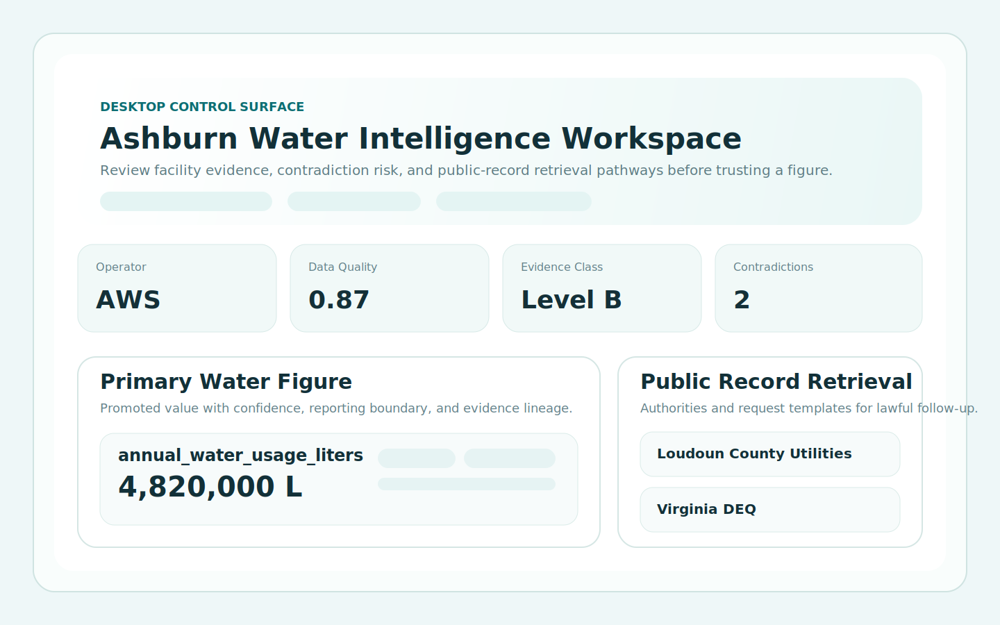
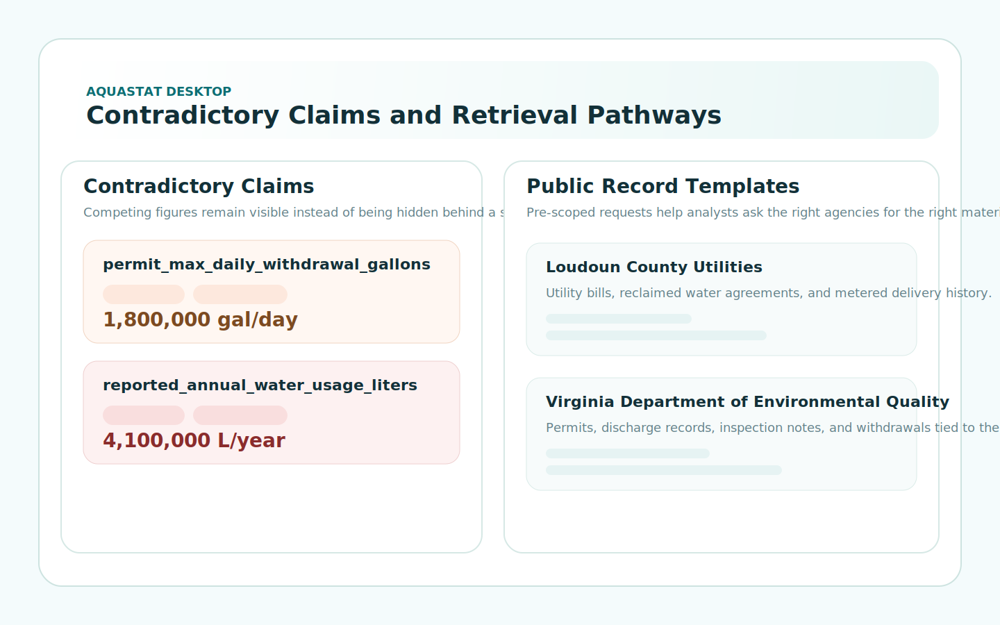

# Desktop App

The repository now includes a strict TypeScript desktop foundation under `desktop/`.

Preview assets:





Current status:

- TypeScript strict mode enabled
- no `any` in the desktop source
- typed AquaStat API client
- local-mode oriented shell foundation
- facility detail and lawful public-record template retrieval wired as the first desktop workflow
- presentable review UI for facility evidence, contradiction tracking, and public-record templates

This is not yet a packaged Electron or Tauri product, but it is a real typed desktop-first foundation rather than a placeholder directory.

## Run It Locally

1. Start the AquaStat API locally on `http://127.0.0.1:8080`.
2. Install desktop dependencies:

```bash
cd desktop
npm install
```

3. Build the desktop shell:

```bash
npm run build
```

4. Open `desktop/index.html` while the API is running.

## What The Desktop Shell Shows

- Facility-level summary metadata
- Primary water figure confidence and evidence class
- Contradictory claim surfacing instead of silent overwrites
- Known public record holders and request-template guidance
- A local-first analyst workflow that can be evolved into Electron or Tauri later
